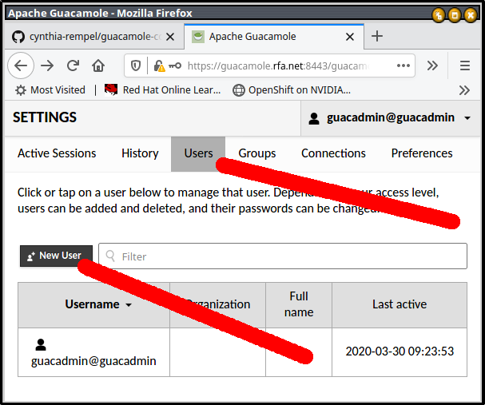
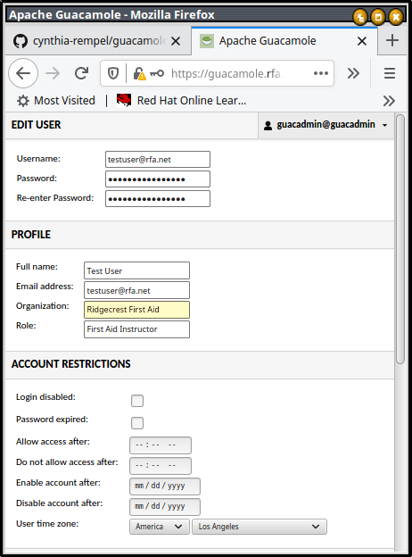
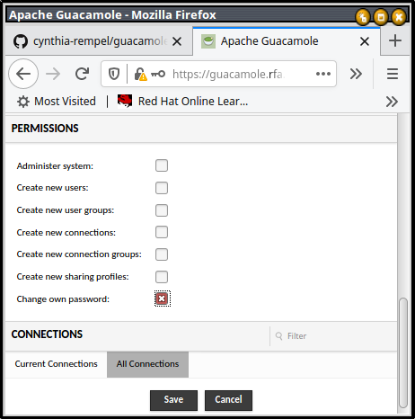
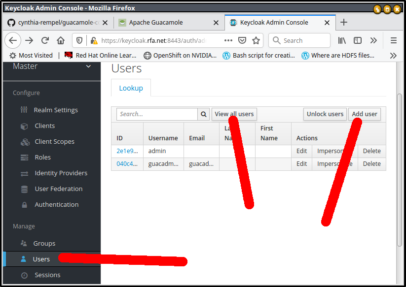
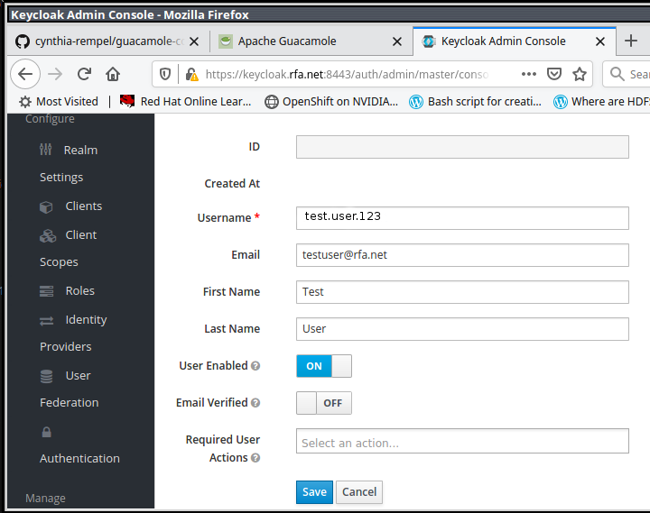
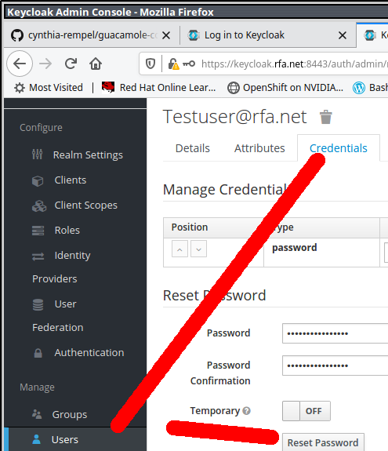
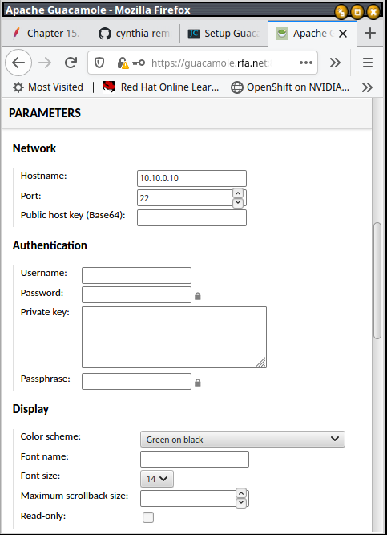

# guacamole-keycloak-nginx
Docker compose project with keycloak and guacamole. Based off of https://github.com/cynthia-rempel/guacamole-compose

## To get started with no configurations, run 

```
(Optional) If you will be connecting Keycloak to Active Directory, add relevant LDAPS Trust Certificates into config/trust/<file>.cer

export SERVER_FQDN=<your server FQDN>

./setup.sh

docker-compose up
```

### Trust the certs

Please add init/guacamole.crt and init/keycloak.crt to your trusted certificates.

### Create the guacadmin user in keycloak

```
# Add the guacadmin user to keycloak with an email
docker exec guacamole-compose_keycloak_1 \
  /opt/jboss/keycloak/bin/kcadm.sh \
  create users \
  -s username=guacadmin@guacadmin \
  -s enabled=true \
  -s email=guacadmin@guacadmin \
  -r master \
  --server https://<host.domain>:8443/auth \
  --realm master \
  --user admin \
  --password admin

# Set the password
docker exec guacamole-compose_keycloak_1 \
  /opt/jboss/keycloak/bin/kcadm.sh \
  set-password \
  --username guacadmin@guacadmin \
  --new-password guacadmin \
  -r master \
  --server https://<host.domain>:8443/auth \
  --realm master \
  --user admin \
  --password admin

# Make guacadmin an admin
docker exec guacamole-compose_keycloak_1 \
  /opt/jboss/keycloak/bin/kcadm.sh \
  add-roles \
  --uusername guacadmin@guacadmin \
  --rolename admin \
  -r master \
  --server https://<host.domain>:8443/auth \
  --realm master \
  --user admin \
  --password admin
```

In current configuration all qery and read-roles.

### TODO: make "read-only" role a default role in keycloak

## To customize:

Find all instances of winllc-dev.com, and replace them to you're liking

```
grep -R winllc-dev.com | grep -v Binary
```

## To use

Then browse to:

https://<host.domain>:8443/guacamole

https://<host.domain>:8443/auth

### To add users

---

Guacamole uses keycloak for identity, and uses postgres for authorization.

```
Guacamole's OpenID Connect ... removing the need for users to log into Guacamole
directly. This module must be layered on top of ... that provide connection
information ... database authentication ....
```

Because of this, ***users have to be added to both keycloak and postgres.***

Reference: https://guacamole.apache.org/doc/gug/openid-auth.html

---

#### Adding a user to Postgres

To add users to postgres, add them through the guacamole application.

https://<host.domain>:8443/guacamole

username: *guacadmin@guacadmin*

password: *guacadmin*

---

**Upper right corner, username, settings**


---

**Middle top, users, left middle, new user**



---

**Make sure the username is in email format, make appropriate selections**



---

**Scroll down, continuing to make appropriate selections, then click save**



***NOTE***: if a connection is under a subgroup, both the subgroup and
connection must be checked for the user to create a connection.

---

#### Adding user to Keycloak

https://<host.domain>:8443/auth

Administration Console

---

**Scroll down, click users, view all users, add user**



---

**Make the keycloak user's email match the username and email of guacamole user**



***NOTE***: The email of the keycloak user must match the username and email of the guacamole user.

---

**Set the password**



*Why doesn't keycloak let you set the password when you create the user ?!?*

---

## Adding Connections

---

**Upper right corner, username, settings**


---

**Middle top, connections, left, new connection**


---

**Make an SSH connection**

- *Name*: some-name

- *Location*: the-group

- *Protocol*: *SSH*

- *Max number of connections*: 2

- *Max number of connections per user*: 2

Reference: https://jasoncoltrin.com/2017/10/04/setup-guacamole-remote-desktop-gateway-on-ubuntu-with-one-script/


---

**Set the host**

**Scroll Down**, under the Network Section set the host



**CLICK SAVE **
---

## Where to send users when you want to tell them RTFM

https://guacamole.apache.org/doc/gug/using-guacamole.html

## To uninstall

```
docker-compose down
./teardown.sh
```

## Reference:

  - https://github.com/airaketa/guacamole-docker-compose/tree/5aac1dccbd7b89b54330155270a4684829de1442
  - https://lemonldap-ng.org/documentation/latest/applications/guacamole
https://guacamole.apache.org/doc/gug/administration.html#connection-management
  - https://jasoncoltrin.com/2017/10/04/setup-guacamole-remote-desktop-gateway-on-ubuntu-with-one-script/
